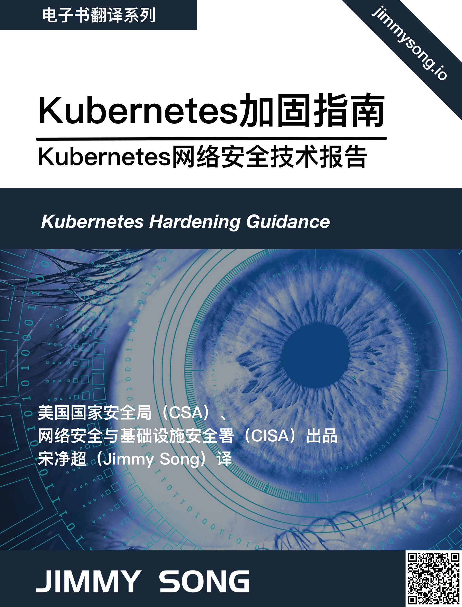

# 《Kubernetes 加固指南》中文版
*Kubernetes Hardening Guidance*（[英文原版 PDF](https://media.defense.gov/2021/Aug/03/2002820425/-1/-1/1/CTR_KUBERNETES%20HARDENING%20GUIDANCE.PDF)） 是由美国国家安全局（CSA）于 2021 年 8 月发布的，详见[出版信息](publication-infomation.md)。其中文版《Kubernetes 加固指南》（或被称作《Kubernetes 强化指南》）是由 [Jimmy Song](https://jimmysong.i) 翻译，[点击在线阅读](https://jimmysong.io/kubernetes-hardening-guidance)，如您发现错误，欢迎在[GitHub](https://github.com/rootsongjc/kubernetes-hardening-guidance)上提交勘误。

## 许可证

您可以使用[署名 - 非商业性使用 - 相同方式共享 4.0 (CC BY-NC-SA 4.0)](https://creativecommons.org/licenses/by-nc-sa/4.0/deed.zh)  协议共享。
